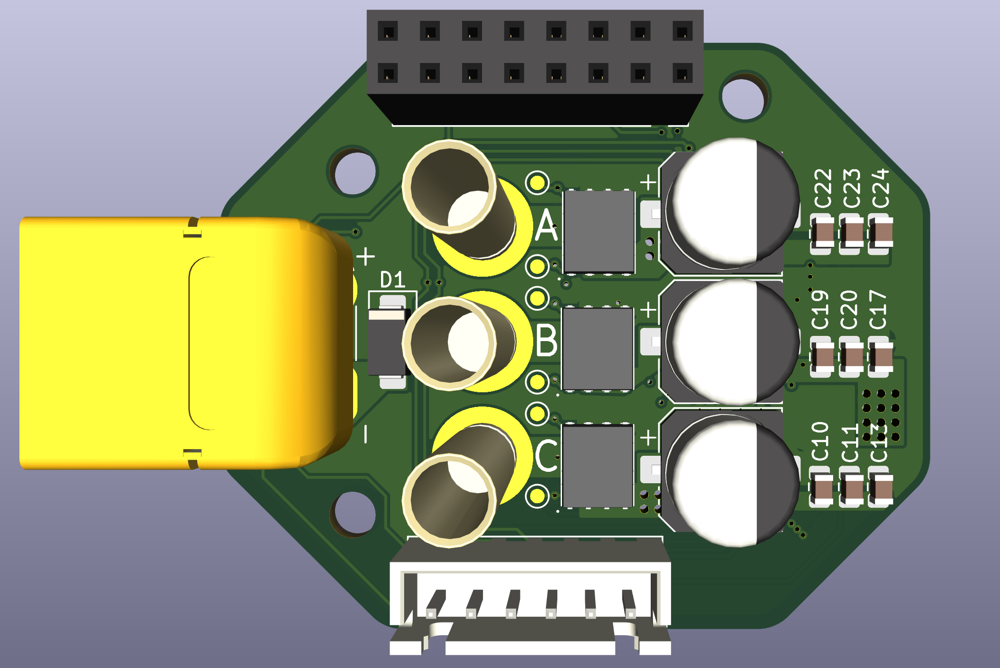
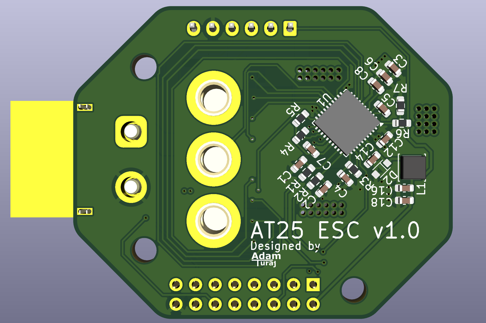
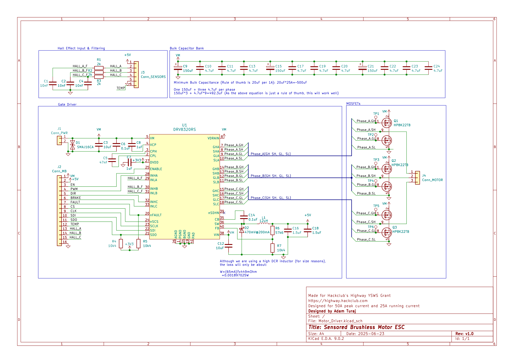

# BLDC ESC

**25A 8.4V Sensored BLDC Motor Driver (DRV8323 Based)**

This ESC was originally designed for my **AT25 project**, but the project was discontinued due to time and budget constraints. The board itself is theoretically still fully functional (I have not physically tested it).

- **Continuous Current:** 25A
- **Peak Current:** 50A
- **Input Voltage:** 8.4V (2S Li-Po)
- **Driver IC:** TI DRV8323
- **Control Mode:** Single PWM mode (simplifies control, avoids heavy math)

## Design Overview

The ESC is built around the **DRV8323** gate driver IC, making use of its 1x PWM control mode for easier firmware integration.

## Renders & Schematics

### 3D Renders

  

### Electrical Schematic

### PCB Layout (4-Layer Stackup)

- **Top Layer (Signals)**  
  .png)

- **Second Layer (Ground Plane)**  
  .png)

- **Third Layer (Power / Signals)**  
  .png)

- **Bottom Layer (Signals)**  
  .png)
